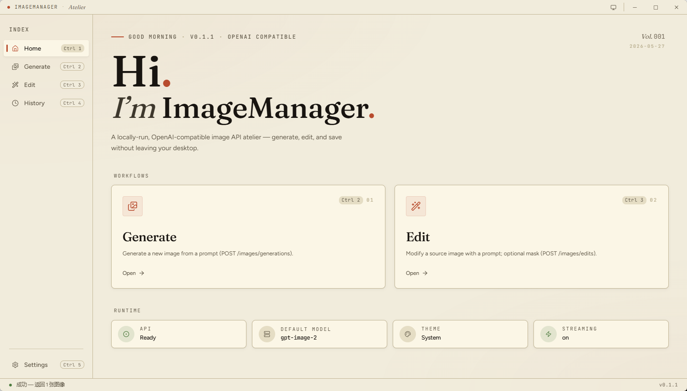
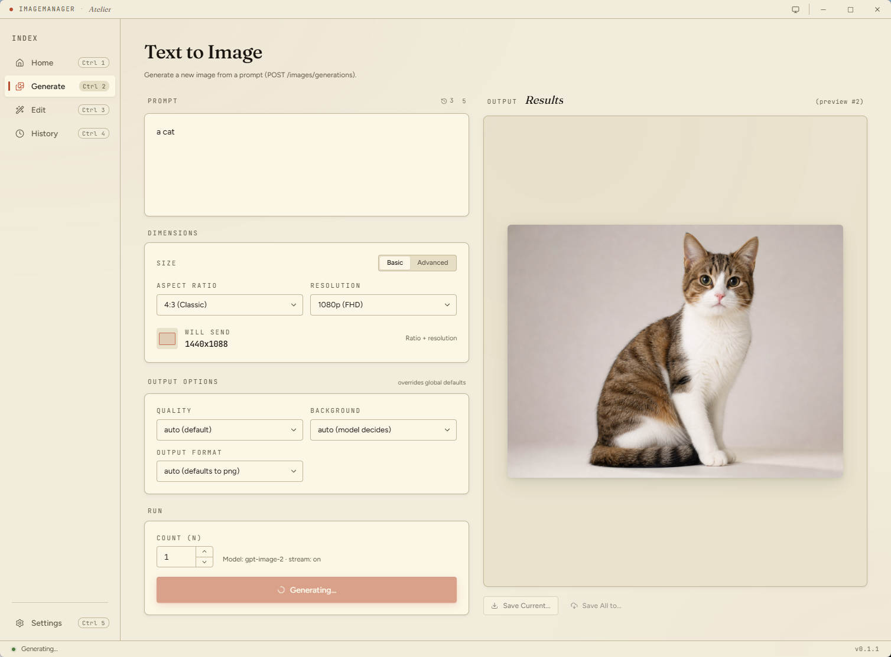

<div align="center">

# ImageManager

[🇨🇳 中文](./README.md) · **🇬🇧 English**

<sub>OpenAI / Google Gemini dual-protocol image-API desktop client · Tauri 2 + Vue 3</sub>

<sub>[Releases](../../releases) · [Issues](../../issues) · [License](./LICENSE)</sub>

</div>

---

ImageManager is a **local-first** desktop client for image-generation APIs. Native support for OpenAI's `gpt-image` family and Google's Gemini (Nano Banana) family — and any compatible gateway sitting in front of them. The config lives on disk, **no telemetry, ever**.

## Screenshots

<p align="center">
  
</p>
<p align="center">
  
</p>

## Features

### Multi-endpoint · multi-model · parameter presets

- Not pinned to a single vendor: manage any number of **OpenAI-compatible** and **Google Gemini** endpoints side by side
- Each endpoint owns multiple models; generation and edit pick independently
- Parameter presets are scoped per "endpoint × model", swap models without re-tuning every time

### Generation & edit

- Full coverage of OpenAI `/v1/images/generations` and `/v1/images/edits`
- Google Gemini speaks the native `generateContent` protocol with `imageConfig.aspectRatio`
- `gpt-image-2` up to **3840×2160 (4K)**, auto-aligned to 16, 1:3–3:1 ratio enforced
- Streaming `partial_image` preview for generation (up to 3 in-flight frames)
- Edit accepts drag-drop / file picker / brushed masks

### History & cache

- Every result is auto-cached — no manual save required
- History view uses a **playing-card stack** layout that fans out on hover with viewport-aware direction (right / left / down / up / mixed)
- Detail view ships a lightbox plus batch and per-image export

### Polish

- **WinUI-3 / Fluent-style hover** — sine-eased press, power3.out release, cards lift to 1.04 and hold
- **Responsive sidebar** — two-threshold collapse + hide, layout never jumps
- **Light / Dark / Follow-System** — system follow is an independent toggle, live-tracks the OS preference
- **Built-in updater** — detects new releases and installs in-place
- **Keyboard-first** — `Ctrl+S` for settings, `Ctrl+Enter` to submit, `Esc` to dismiss

## Download

Grab the right artifact from the [Releases page](../../releases):

| Platform | File | Install |
|---|---|---|
| **Windows** (x64) | `ImageManager_x.y.z_x64_en-US.msi` | Double-click |
| **Windows portable** | `ImageManager.exe` (unzip-and-run) | Extract anywhere, double-click; `config.json` lives next to the exe |
| **macOS** (Universal) | `ImageManager_x.y.z_universal.dmg` | Drag into Applications |
| **Linux** | `.AppImage` / `.deb` | See below |

<details>
<summary>Linux install notes</summary>

```bash
# AppImage
chmod +x ImageManager_*.AppImage && ./ImageManager_*.AppImage

# deb
sudo dpkg -i ImageManager_*.deb
```

Requires `libwebkit2gtk-4.1` to be installed system-wide.

</details>

## Quickstart

1. Launch the app → lands on the Home view
2. First-run shows a **two-step onboarding**:
   - **Step 1:** Add an endpoint — pick OpenAI or Google, fill in name, `base_url`, `api_key`, optionally test the connection
   - **Step 2:** Add a model — pick from that endpoint type's preset list, or tick "Custom" and type any model id
3. Head to the Generate view, type a prompt → `Ctrl+Enter` to submit
4. Manage endpoints / models / param presets later via Settings (`Ctrl+S`)

## Config file location

| Platform | Path |
|---|---|
| **Windows** | `<exe folder>\config.json` 🍃 portable mode |
| **macOS** | `~/Library/Application Support/com.imagemanager.app/config.json` |
| **Linux** | `~/.config/com.imagemanager.app/config.json` |

Changes are **auto-persisted** — Switch / Select / NumberInput write immediately; text inputs (`base_url` / `api_key` etc.) flush on blur.

The About tab has shortcuts to "Open with default app" and "Reveal in file manager" if you need to grab the file directly.

## Keyboard shortcuts

| Shortcut | Action |
|---|---|
| `Ctrl+S` / `Ctrl+,` | Open Settings |
| `Ctrl+Enter` | Submit generation / edit on the current view |
| `Esc` | Dismiss popovers / blur focus |
| `↑ / ↓ / Enter / Esc` | Navigate inside Comboboxes |

`Ctrl` accepts `⌘` on macOS.

## Supported models

### OpenAI endpoints

| Model ID | Notes |
|---|---|
| `gpt-image-2` | Default, up to 4K, auto high-fidelity |
| `gpt-image-1.5` / `gpt-image-1` / `gpt-image-1-mini` | Compatible older models |
| `dall-e-2` / `dall-e-3` | Legacy, kept for compatibility |

#### `gpt-image-2` size constraints

- Both sides must be **divisible by 16**
- Aspect ratio between **1:3 and 3:1**
- Max single side **3840 px**, total pixels between 655,360 and 8,294,400
- Anything over 2560×1440 is upstream-tagged "experimental" (but still usable)

The app rounds and validates dimensions for you and shows the real outgoing size live in the UI.

### Google endpoints

| Model ID | Alias |
|---|---|
| `gemini-3.1-flash-image-preview` | **Nano Banana 2** |
| `gemini-3-pro-image-preview` | **Nano Banana Pro** |

> Gemini uses `imageConfig.aspectRatio` for ratio control; OpenAI-specific params like `size` / `n` / `quality` / `background` are ignored. The UI auto-hides the irrelevant controls under Google models.

Both endpoint types support **custom model IDs** — tick "Custom" and type any vendor-specific string.

## Development

### Toolchain

- [Bun](https://bun.sh/) ≥ 1.0
- [Rust](https://rustup.rs/) stable
- Platform deps:
  - Windows: MSVC build tools
  - macOS: Xcode Command Line Tools
  - Linux: `libwebkit2gtk-4.1-dev` `librsvg2-dev` `libayatana-appindicator3-dev` `patchelf`

### Commands

```bash
bun install            # frontend deps
bun run tauri dev      # dev (HMR + Rust shell)
bun run tauri build    # bundle to src-tauri/target/release/
bun run vue-tsc -b     # type-check only
```

### Project layout

```
src/
  components/      Shell / TitleBar / Onboarding / settings sub-components
  composables/     useEnterAnimation (the v-anim directive) / paramOverrides
  stores/          Pinia: config / cache / history / onboarding / pendingPrompt
  services/        apiClient / googleClient / config / sizeCalc / updater / version
  views/           HomeView / GenerateView / EditView / HistoryView / SettingsView / HistoryDetailView
  router/          vue-router config
  i18n/            zh.ts / en.ts / init
  assets/main.css  Tailwind entry + global rules
src-tauri/
  capabilities/    Tauri permission manifests
  src/             Rust entry (mostly empty — front-end driven)
  tauri.conf.json  window / bundle / identifier
.github/workflows/
  ci.yml           PR type-check + cross-platform cargo check
  release.yml      tag-push triggers cross-platform build + release
```

### Stack

- **Tauri 2** — Rust shell + WebView
- **Vue 3.5** + **TypeScript** + **Vite 7**
- **Nuxt UI v4** (standalone Vue 3 mode) + **Tailwind CSS v4**
- **Pinia 3** — state management
- **vue-router 4** + **vue-i18n 10**
- **GSAP** — `v-anim` directive + route transitions + history card hover
- **VueUse** — `useMediaQuery`, etc.
- **Lucide** (via `@iconify-json/lucide`) — icons

## Release flow

Version is **single-sourced** from `package.json`. `src-tauri/tauri.conf.json` reads it via `"version": "../package.json"`; `Cargo.toml`'s version does not affect the bundled app.

```bash
# 1. Bump package.json's version field
# 2. Commit
git add package.json && git commit -m "chore: bump version to x.y.z"

# 3. Tag + push
git tag vx.y.z
git push origin main vx.y.z
```

Pushing the tag triggers [`release.yml`](.github/workflows/release.yml) — parallel Windows / macOS / Linux builds upload to a **Draft Release** ready for manual review before publishing.

## License

Apache License 2.0 — see [LICENSE](./LICENSE). PRs welcome.

## Credits

- [OpenAI](https://openai.com/) · [Google AI](https://ai.google.dev/) — image generation APIs
- [Tauri](https://tauri.app/) — desktop app framework
- [Nuxt UI](https://ui.nuxt.com/) — component library
- [GSAP](https://gsap.com/) — animation engine
- [Lucide](https://lucide.dev/) — icons
