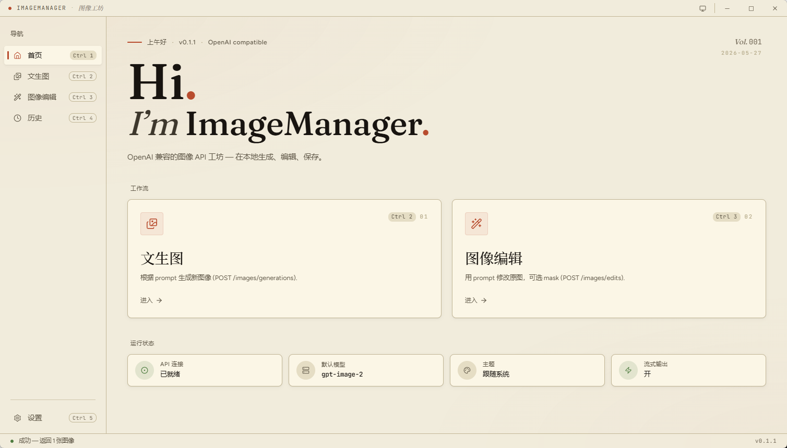
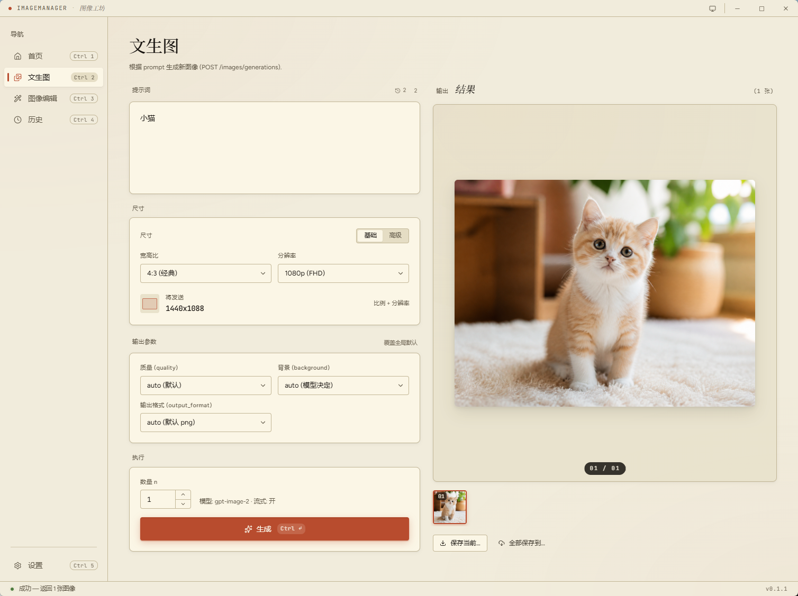

<div align="center">

# ImageManager

**🇨🇳 中文** · [🇬🇧 English](./README.en.md)

<sub>OpenAI / Google Gemini 双协议图像 API 桌面客户端 · Tauri 2 + Vue 3</sub>

<sub>[Releases](../../releases) · [Issues](../../issues) · [License](./LICENSE)</sub>

</div>

---

ImageManager 是一个**本地优先**的图像 API 桌面客户端。原生支持 OpenAI 的 `gpt-image` 系列和 Google 的 Gemini（Nano Banana）系列,也能对接任意兼容代理。配置文件落在本地,**不向任何第三方发送遥测**。

## 截图

<p align="center">
  
</p>
<p align="center">
  
</p>

## 特性

### 多端口 · 多模型 · 参数预设

- 不绑定单一服务商:同时管理任意数量的 **OpenAI 兼容端点**和 **Google Gemini 端点**
- 每个端点下挂多个模型,文生图和图像编辑可独立选择不同模型
- 参数预设按"端点 + 模型"维度独立保存,切模型时一键复用

### 文生图 / 图像编辑

- 完整覆盖 OpenAI `/v1/images/generations` 与 `/v1/images/edits`
- Google Gemini 走原生 `generateContent` 协议,支持 `imageConfig.aspectRatio`
- `gpt-image-2` 支持到 **3840×2160 (4K)**,自动按 16 对齐 + 1:3–3:1 比例约束
- 文生图支持流式 `partial_image` 预览(最多 3 张过渡帧)
- 图像编辑支持拖入 / 选择文件 / 涂抹蒙版

### 历史 & 缓存

- 每次生成自动落盘,无需手动保存
- 历史页**扑克牌叠图**布局,hover 时按卡片视口位置智能 fan-out(左/右/上/下/混合)
- 详情页内置 lightbox + 批量另存为 / 单张导出

### 体验细节

- **WinUI 3 / Fluent 风格的 hover 动效** — sine 缓动按压、power3.out 释放、卡片浮起 1.04
- **响应式 sidebar** — 双阈值(收缩 / 隐藏),布局零跳变
- **浅 / 深主题** + 跟随系统(独立开关,系统变化实时跟)
- **自动更新器** — 检测到新版本一键升级,无需重新下载
- **键盘优先** — `Ctrl+S` 设置 / `Ctrl+Enter` 提交 / `Esc` 关闭

## 下载

到 [Releases 页面](../../releases) 选择对应平台:

| 平台 | 文件 | 安装方式 |
|---|---|---|
| **Windows** (x64) | `ImageManager_x.y.z_x64_en-US.msi` | 双击安装 |
| **Windows 绿色版** | `ImageManager.exe`(解压即用) | 解压到任意目录,双击启动,配置文件就在 exe 旁边 |
| **macOS** (Universal) | `ImageManager_x.y.z_universal.dmg` | 拖入 Applications |
| **Linux** | `.AppImage` / `.deb` | 见下方 |

<details>
<summary>Linux 安装备注</summary>

```bash
# AppImage
chmod +x ImageManager_*.AppImage && ./ImageManager_*.AppImage

# deb
sudo dpkg -i ImageManager_*.deb
```

需要系统已安装 `libwebkit2gtk-4.1`。

</details>

## 首次使用

1. 启动应用 → 默认进入首页
2. 首次启动会弹出**两步引导向导**:
   - **Step 1:** 添加端点 — 选择类型(OpenAI / Google),填名称、`base_url`、`api_key`,可测试连接
   - **Step 2:** 添加模型 — 从该端点类型的预置列表选(或勾选「自定义」输入任意模型名)
3. 完成后进入文生图,输入 prompt → `Ctrl+Enter` 提交
4. 之后随时在**设置**(`Ctrl+S`)里管理端点 / 模型 / 参数预设

## 配置文件位置

| 平台 | 路径 |
|---|---|
| **Windows** | `<exe 同目录>\config.json` 🍃 绿色模式 |
| **macOS** | `~/Library/Application Support/com.imagemanager.app/config.json` |
| **Linux** | `~/.config/com.imagemanager.app/config.json` |

改了配置**自动持久化** — Switch / Select / NumberInput 即时写盘;文本输入框(`base_url` / `api_key` 等)在 blur 时写盘。

设置页底部有「用默认程序打开」与「在资源管理器中显示」两个按钮,可以直接定位文件。

## 快捷键

| 快捷键 | 功能 |
|---|---|
| `Ctrl+S` / `Ctrl+,` | 打开设置 |
| `Ctrl+Enter` | 提交当前页面的生成 / 编辑 |
| `Esc` | 关闭弹窗 / 取消焦点 |
| `↑ / ↓ / Enter / Esc` | 在 Combobox 内导航 |

macOS 上 `Ctrl` 也接受 `⌘`。

## 模型支持

### OpenAI 端点

| 模型 ID | 备注 |
|---|---|
| `gpt-image-2` | 默认,最高 4K,自动高保真 |
| `gpt-image-1.5` / `gpt-image-1` / `gpt-image-1-mini` | 兼容老接口 |
| `dall-e-2` / `dall-e-3` | 旧接口,仅供兼容 |

#### `gpt-image-2` 尺寸约束

- 两边都必须能被 **16 整除**
- 长宽比在 **1:3 到 3:1** 之间
- 最大单边 **3840 px**,总像素 655,360 ~ 8,294,400
- 超过 2560×1440 的分辨率上游标记为 "experimental"(仍可用)

应用自动按这些规则计算 / 圆整,UI 实时显示真实将发送的尺寸。

### Google 端点

| 模型 ID | 别名 |
|---|---|
| `gemini-3.1-flash-image-preview` | **Nano Banana 2** |
| `gemini-3-pro-image-preview` | **Nano Banana Pro** |

> Gemini API 用 `imageConfig.aspectRatio` 控制比例,`size` / `n` / `quality` / `background` 等 OpenAI 专属参数会被忽略。UI 在 Google 模型下自动隐藏不适用的参数控件。

支持**自定义模型 ID** — 任意端点都可勾选「自定义」输入服务商专属的模型字符串。

## 开发

### 环境

- [Bun](https://bun.sh/) ≥ 1.0
- [Rust](https://rustup.rs/) stable
- 平台依赖:
  - Windows:MSVC build tools
  - macOS:Xcode Command Line Tools
  - Linux:`libwebkit2gtk-4.1-dev` `librsvg2-dev` `libayatana-appindicator3-dev` `patchelf`

### 命令

```bash
bun install            # 装前端依赖
bun run tauri dev      # 启动 dev(HMR + Rust shell)
bun run tauri build    # 编译产物到 src-tauri/target/release/
bun run vue-tsc -b     # 仅类型检查
```

### 项目结构

```
src/
  components/      Shell / TitleBar / Onboarding / 各 settings 子组件
  composables/     useEnterAnimation(v-anim 指令) / paramOverrides
  stores/          Pinia: config / cache / history / onboarding / pendingPrompt
  services/        apiClient / googleClient / config / sizeCalc / updater / version
  views/           HomeView / GenerateView / EditView / HistoryView / SettingsView / HistoryDetailView
  router/          vue-router 配置
  i18n/            zh.ts / en.ts / 初始化
  assets/main.css  Tailwind 入口 + 全局规则
src-tauri/
  capabilities/    Tauri 权限清单
  src/             Rust 入口(基本空,前端为主)
  tauri.conf.json  窗口 / bundle / 标识符
.github/workflows/
  ci.yml           PR 类型检查 + 跨平台 cargo check
  release.yml      tag push 触发跨平台编译 + 自动 release
```

### 技术栈

- **Tauri 2** — Rust shell + WebView
- **Vue 3.5** + **TypeScript** + **Vite 7**
- **Nuxt UI v4**(standalone Vue 3 模式) + **Tailwind CSS v4**
- **Pinia 3** — 状态管理
- **vue-router 4** + **vue-i18n 10**
- **GSAP** — `v-anim` 指令 + 路由过渡 + 历史卡片 hover 动效
- **VueUse** — `useMediaQuery` 等响应式工具
- **Lucide**(via `@iconify-json/lucide`) — 图标

## 发布流程

版本号**单一来源**:只改 `package.json` 的 `version`。`src-tauri/tauri.conf.json` 通过 `"version": "../package.json"` 自动读取,`Cargo.toml` 不影响打包出来的应用版本。

```bash
# 1. 改 package.json 的 version 字段
# 2. 提交
git add package.json && git commit -m "chore: bump version to x.y.z"

# 3. 打 tag + push
git tag vx.y.z
git push origin main vx.y.z
```

push tag 触发 [`release.yml`](.github/workflows/release.yml),并行编译 Windows / macOS / Linux 上传到 **Draft Release** — 人工审阅后点 Publish 即正式发布。

## License

Apache License 2.0 — 详见 [LICENSE](./LICENSE)。欢迎 PR。
